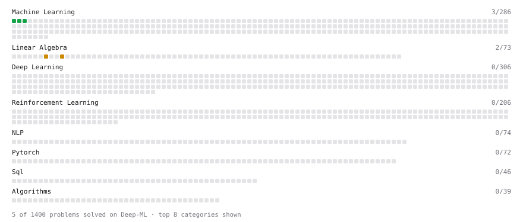

# Deep-ML

My machine learning practice from [Deep-ML](https://www.deep-ml.com). Every solution here was written by hand.

**2** solved · 2 problems · 0 labs · 0 math

[**Browse the interactive portfolio**](https://harshitgupta04022004.github.io/deep-ml/) to replay this filling in over time.

## Problems

| | Difficulty | Solved | |
| --- | --- | --- | --- |
| [Matrix Transformation ](https://www.deep-ml.com/problems/7) | medium | 2026-09-15 | [solution](problems/0007-matrix-transformation) |
| [Solve Linear Equations using Jacobi Method](https://www.deep-ml.com/problems/11) | medium | 2026-09-15 | [solution](problems/0011-solve-linear-equations-using-jacobi-method) |

---

_This file is regenerated by Deep-ML on every push._
